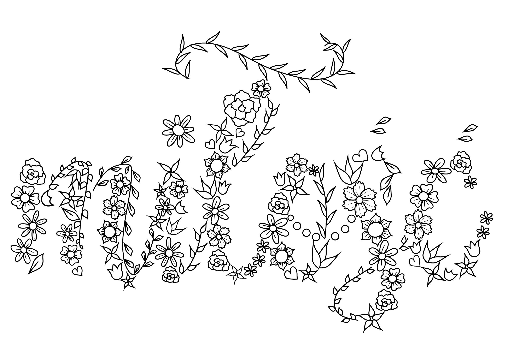
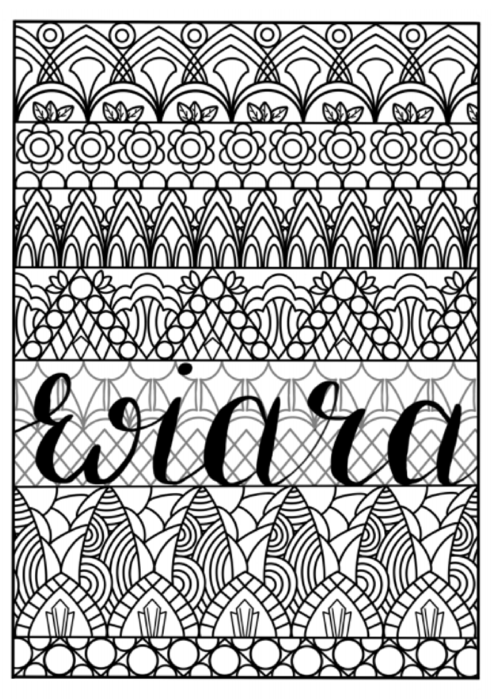
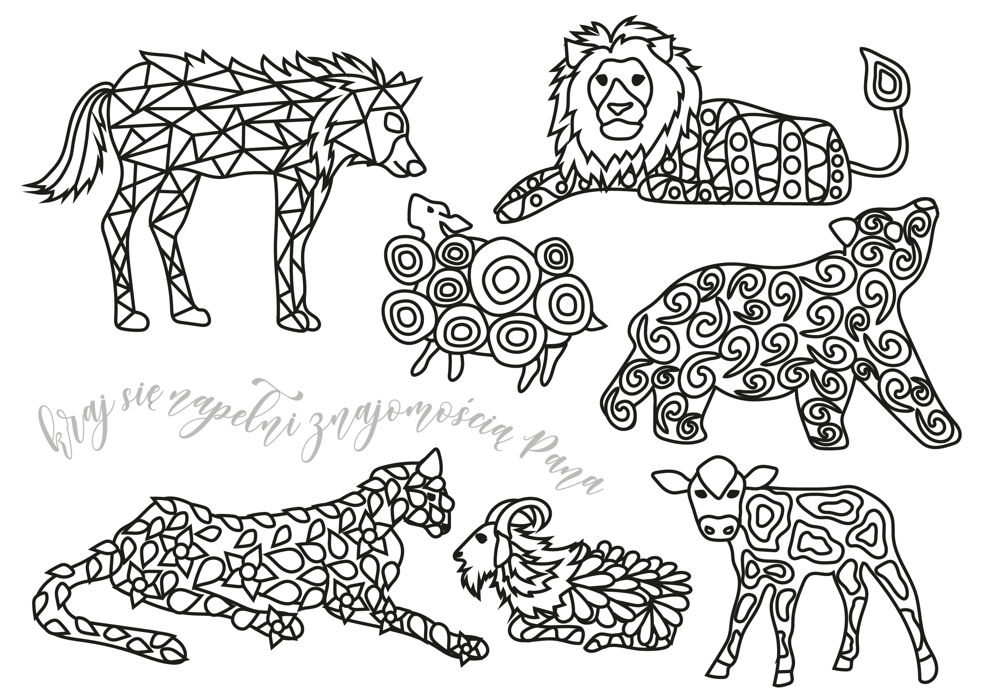
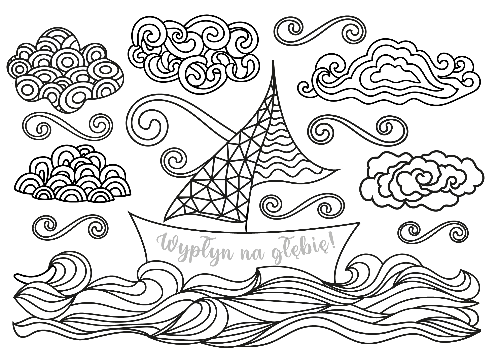
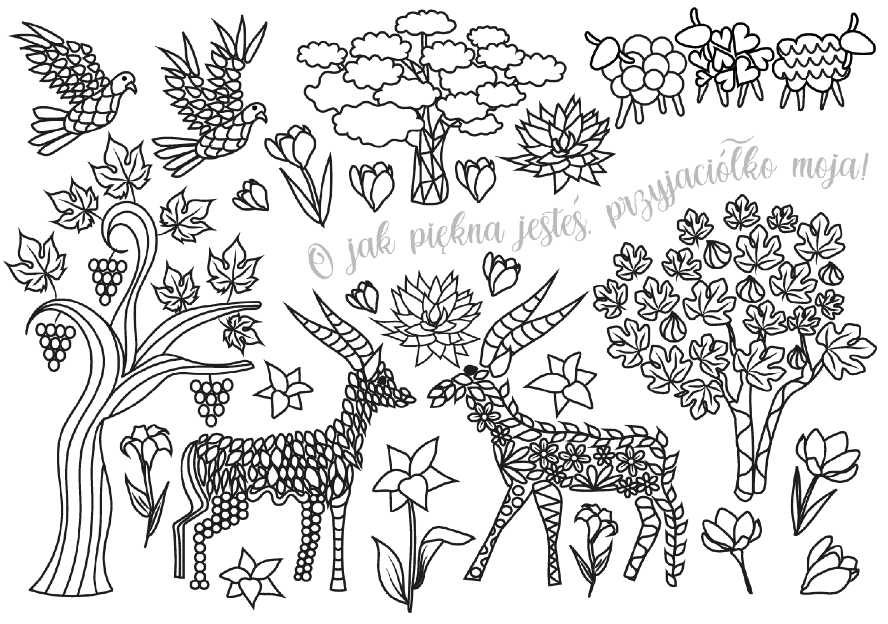
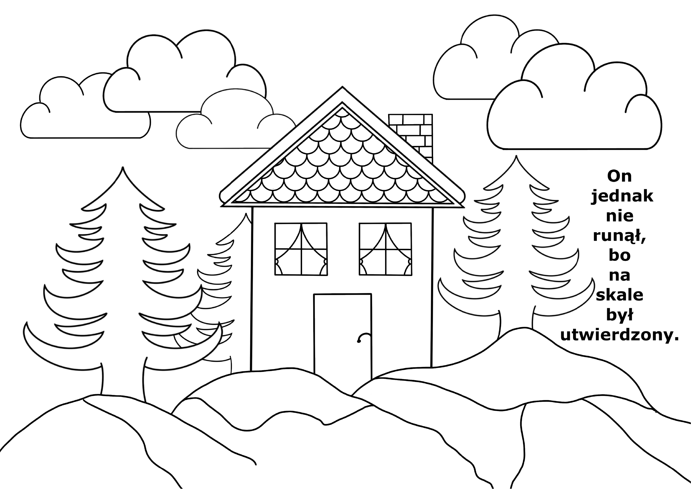

## Kolorowanki

Jesteśmy przykładem na to, że tworzenie pięknych rzeczy dostępne 
jest dla każdego.

Dlatego przygotowałyśmy dla Ciebie
 
<h2 class="text-handwritten">kolorowanki. </h2>

Pakiet zawiera 10 kolorowanek inspirowanych Słowem.
  Jego cena to 10 złotych.

Możesz zamówić je poprzez poniższy formularz:
 
  
                          
<iframe class=form src="https://docs.google.com/forms/d/e/1FAIpQLSdvkkOF393dD68qW2XvqCUrUDlWLFBNXfLHookPX7j2EjYFkA/viewform?embedded=true" width="640" height="673" frameborder="0" marginheight="0" marginwidth="0">Ładuję…</iframe>

Po dokonaniu zamówienia otrzymasz od nas maila ze szczegółami dotyczącymi płatności. Po dokonaniu płatności wyślemy Ci plik z kolorowankami, które będziesz mógł wydrukować.
  

  

  
  

  

