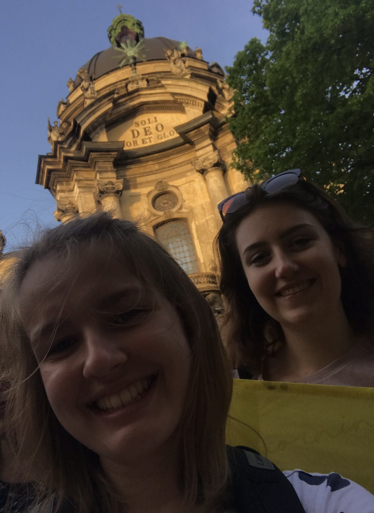
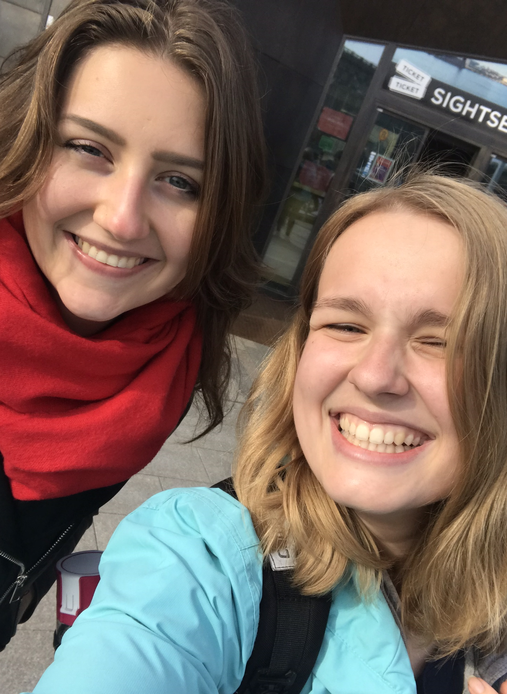

---
---
# O nas

<h2 class="text-handwritten">Jesteśmy Dominika i Olga. </h2>

 
Połączyła nas działalność w ASK Soli Deo. 

•••

Dominika jest absolwentką prawa i najbardziej ambitną osobą jaką znam. Potrafi wszystkiego się nauczyć i zdecydowanie nie ma dla niej rzeczy niemożliwych - są tylko takie, które wymagają więcej czasu i zaangażowania niż inne. 
 
Jest niesamowicie kreatywna, pracowita i empatyczna. Uwielbiam z nią współpracować i tworzyć totalnie wszystko co tylko potrafimy sobie wyobrazić - czyli spełniać marzenia! 
 A wszystko zaczęło się od tego jak zaimponowała mi zjedzeniem całej porcji churrosów w Sztokholmie, tak można zdobyć moją przyjaźń i zaufanie.
  
~Olga

•••

Są na świecie osoby mające wyjątkową łatwość w nawiązywaniu kontaktów oraz przyciąganiu innych ludzi do siebie i do swoich inicjatyw. Taką osoba jest Olga. 
 
Olga na każdym kroku uczy mnie, że Bóg nas bardzo kocha i że pragnie spełnić wszystkie nasze marzenia.  
Olga zajmuje się w swoim życiu wieloma wartościowymi rzeczami - nie tylko pracą, działalnością w Stowarzyszeniu i naszą wspólną twórczością - zawsze potrafi też znaleźć chwilę dla drugiego człowieka, okazując mu przy tym maksimum ciepła i uwagi.
  ~Dominika

•••

Poza twórczością, łączy nas także zamiłowanie do podróży i dobrego jedzenia, a zwłaszcza lodów.

Jeżeli podoba Ci się nasza twórczość i chcesz podjąć z nami współpracę, albo podzielić się tym, jak Ciebie inspiruje Słowo,
 

<a class="text-handwritten h2" href="https://do.slownie.com/kontakt/">napisz do nas.</a>

•••

